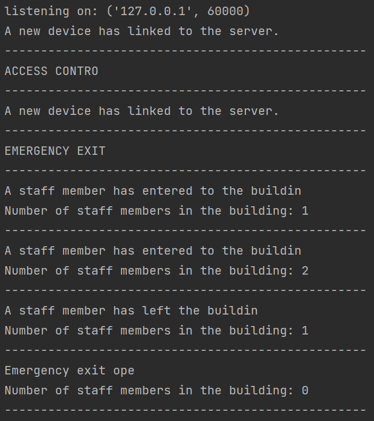
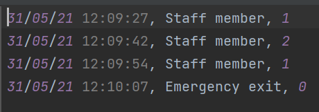
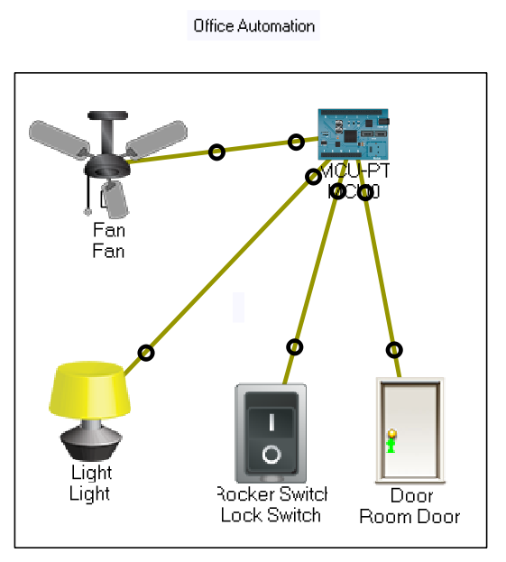
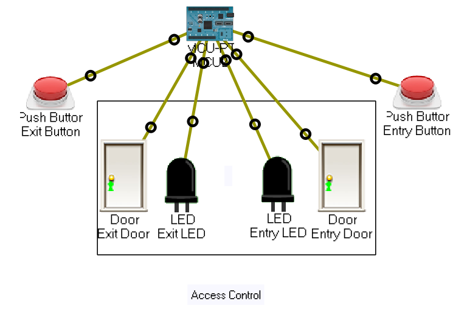
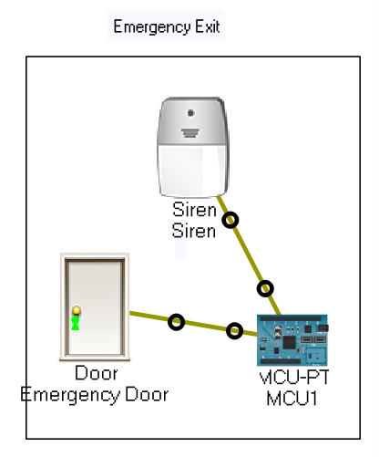

# Python and IoT - Office

## Table of contents
- [Project](#project)
- [Usage](#usage)
- [Server](#server)
- [Office Automation Room](#office-automation-room)
- [Access Control Room](#access-control-room)
- [Emergency Exit Room](#emergency-exit-room)

## Project
Project goal was to learn Python 3 and IoT. Project demonstrates how to connect office equipment with server.  
Project includes TCP server and three different office scenarios. Office equipment's demonstration was executed with Cisco Packet Tracer.  
Server and office equipment programming was executed with Python 3. 

## Usage
Clone this repository and run the [Server.py](./src/Server.py) file. Open [Office-Python-and-IoT-Assignment.pkt] (Office-Python-and-IoT-Assignment.pkt
.pkt) file with Cisco Packet Tracer and run Python scripts from each room MCU board. After that, you can start playing around and see what happens. 

## Server

Server is built with Python 3. Server informs when a new device is connected and shows the current count of members inside the building. 

All the actions will be logged to the log file.

## Office Automation Room

Office automation room demonstrates, how devices inside the room are connected with each other's. When people come in the room  
(door opens and closes) the fan and lights will turn on. When people lefts the room (door opens and closes again)  
fan and lights are turning off. When someone is inside the room, door can be locked by clicking the log switch.  
After that, door can't be opened before lock switch has been clicked again. 

## Access control Room

The access control room demonstrates, how peoples can come in and out by clicking the exit or entry buttons.  
When user pushes the entry button, entry door will open for 5 seconds and the led will turn on. After 5 seconds 
exit door will open automatically for 5 seconds and the exit led will turn on. Exit door works the same way.  

Server keeps on track how many peoples has been entered to the office and exit from the office. 

## Emergency Exit Room

When the emergency exit door is opened the siren will turn on. Server get and information, that all the peoples  
has left the building. When the emergency door is closed, siren will turn off. 

